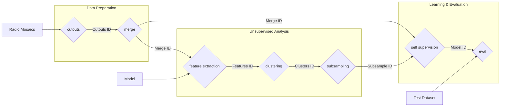

# Data curation for deep learning tasks in radio-astronomy
This repository provides a complete pipeline for large-scale data curation in radio astronomy, specifically designed to prepare optimized datasets for deep learning tasks. Starting from raw survey mosaics, such as those from the LoTSS (LOFAR Two-metre Sky Survey), the pipeline executes a series of steps to extract, analyze, group, and select the most informative images.
The final goal is to build a high-quality, curated dataset by reducing redundancy and isolating salient features through unsupervised techniques like clustering and Self-Supervised Learning. This process is crucial for training robust and efficient deep learning models on complex radio astronomy data.

## Pipeline execution example

```bash
python cutouts_sw.py --mosaics_path ../LoTSS/DR2 --window_size 128 --overlap 0.5
output -> b947261e35b6451cae12f66ad5f30c9b
# add cutouts_mask
python merge.py --cutouts_ids b947261e35b6451cae12f66ad5f30c9b
output -> c6e73956a66a49f98117157279342b47
python feature_extraction.py --merge_id c6e73956a66a49f98117157279342b47
output -> vhf34j554ih6u45ith89
python src/4_clustering.py --features_id vhf34j554ih6u45ith89 --config_path configs/clusters/test.yaml
output -> r438th58849j9fd23j29
python subsampling.py --clusters_id r438th58849j9fd23j29 --target_size 200000
output -> t67ge23tr67348r73497
python self_sup.py --subsample_id t67ge23tr67348r73497 --merged_cutouts_id c6e73956a66a49f98117157279342b47
output -> 54tg65y543yt3f32f
python eval.py --model_id 54tg65y543yt3f32f --dataset mnist
```

## Pipeline Diagram
The following diagram illustrates the complete workflow, from generating cutouts to training and evaluating the final model.

