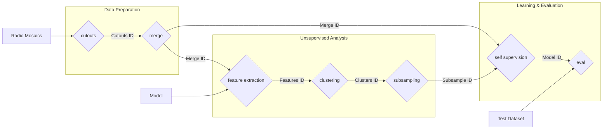

# Data curation for deep learning tasks in radio-astronomy
This repository provides a complete pipeline for large-scale data curation in radio astronomy, specifically designed to prepare optimized datasets for deep learning tasks. Starting from raw survey mosaics, such as those from the LoTSS (LOFAR Two-metre Sky Survey), the pipeline executes a series of steps to extract, analyze, group, and select the most informative images.
The final goal is to build a high-quality, curated dataset by reducing redundancy and isolating salient features through unsupervised techniques like clustering and Self-Supervised Learning. This process is crucial for training robust and efficient deep learning models on complex radio astronomy data.

## Pipeline execution example

```bash
python cutouts_sw.py --mosaics_path ../LoTSS/DR2 --window_size 128 --overlap 0.5
output -> b947261e35b6451cae12f66ad5f30c9b
# add cutouts_mask
python merge.py --cutouts_ids b947261e35b6451cae12f66ad5f30c9b
output -> c6e73956a66a49f98117157279342b47
python feature_extraction.py --merge_id c6e73956a66a49f98117157279342b47
sbatch slurms/3_feat_extract_chunk --source_id c6e73956a66a49f98117157279342b47 --model_type  andrea_dino --model_name /leonardo_work/INA24_C5B09/ssl_code/models/finetune-dinov2-small-rgb-2x4/checkpoints --module_name layernorm --normalization imagenet --resize 256 --batch_size 1024

--- radio-astronomy ---
sbatch slurms/3_feat_extract_chunk_fast --source_id c6e73956a66a49f98117157279342b47 --model_type  cecconello_ssl --model-name resnet18 --ckpt-path /leonardo_work/INA24_C5B09/solo-learn-radio/trained_models/byol/dnqos6hx --module_name avgpool --normalization minmax --resize 224 --batch_size 1024


output -> vhf34j554ih6u45ith89
python src/4_clustering.py --features_id vhf34j554ih6u45ith89 --config_path configs/clusters/test.yaml
output -> r438th58849j9fd23j29
python subsampling.py --clusters_id r438th58849j9fd23j29 --target_size 200000
output -> t67ge23tr67348r73497
python self_sup.py --subsample_id t67ge23tr67348r73497 --merged_cutouts_id c6e73956a66a49f98117157279342b47
output -> 54tg65y543yt3f32f
python eval.py --model_id 54tg65y543yt3f32f --dataset mnist
```

# slurm commands
## feature extraction
```sh
sbatch slurms/3_feat_extract_chunk_fast --source_id c6e73956a66a49f98117157279342b47 --model_type  andrea_dino --model_name /leonardo_work/INA24_C5B09/ssl_code/models/finetune-dinov2-small-rgb-2x4/checkpoints --module_name layernorm --normalization imagenet --resize 256 --batch_size 4096
```
```sh
sbatch slurms/3_feat_extract_chunk_fast --source_id c6e73956a66a49f98117157279342b47 --model_type  andrea_dino --model_name /leonardo_work/INA24_C5B09/models/finetune-vit-small-patch16-224-rgb-mask0.5-patch8-l2_l1-decRestart-encWarmup--bkup/checkpoints --module_name layernorm --normalization imagenet --resize 224 --batch_size 4096
```


## Pipeline Diagram
The following diagram illustrates the complete workflow, from generating cutouts to training and evaluating the final model.



## Funzioni
### scripts
```non_overlap_filtering.py```

prende una lista di json specificata nel file.
restituice una lista di json manetendo gli indici e filtrando i cutout overlappati.

---
```read_hdf5.py```

example to read hdf5 with features and image_paths

---
```analyze_subsample.py```

makes umap out of subsamples

### src
```feature_extraction.py```

prende in ingresso dei merged cutouts e un modello
restituisce una lista di features con path associati
crea la lista come HDF5 riempiendola di volta in volta per non saturare la memoria.

---
```analyze_features.py```

Prende in ingresso delle features e analizza:
umap
nearest neighbors
dimentionality collapse
rank-me
...

---
```umap_on_features_or_subsamples```

Lo script opera in due modalità esclusive: full o subsample.

#### Modalità di Base

1. Modalità full (su tutto il dataset HDF5)
```python run_umap.py --features_id <ID_RUN_FEATURES>```
2. Modalità subsample (su un sottoinsieme di dati)
```python run_umap.py --subsample_id <ID_RUN_SUBSAMPLE>```

#### Opzioni Comuni
- Loggare i risultati su MLflow (consigliato):
    - Aggiungere --log_to_mlflow a qualsiasi comando.

        ```python run_umap.py --features_id <ID> --log_to_mlflow```

- Personalizzare i parametri UMAP:
    - cluster più densi e struttura locale
        
        ```python run_umap.py --features_id <ID> --n_neighbors 15 --min_dist 0.05```

    - Usa la metrica 'cosine':

        ```python run_umap.py --subsample_id <ID> --metric cosine```


- Specificare il server MLflow e la qualità dell'immagine:
```python run_umap.py --features_id <ID> --tracking_uri "http://MLFLOW_SERVER:PORT" --dpi 150```

Tabella Argomenti

| Argomento | Descrizione |Default|
|---------------|-------------|---------|
| --features_id | ID del run MLflow per la modalità Full.	| Obbligatorio |
| --subsample_id |	ID del run MLflow per la modalità Subsample.|	Obbligatorio |
| --log_to_mlflow |	Abilita il logging su MLflow. |	False |
| --n_neighbors |	Parametro n_neighbors di UMAP. |	50 |
| --min_dist |	Parametro min_dist di UMAP. |	0.1 |
| --metric |	Metrica di distanza per UMAP. |	'euclidean' |
| --dpi |	Risoluzione (DPI) per le immagini. |	300 |
| --tracking_uri |	URL del server MLflow.	(Default MLflow) | È obbligatorio fornire --features_id OPPURE --subsample_id. |
## TODO
scripts per funzioni di utilità di recupero informazioni:
- lettura/ricerca features, cutouts, clusters, subsample


features:
f6c78f4e5cda4eafaa54501b8f7e5298 - andreadinov2grey